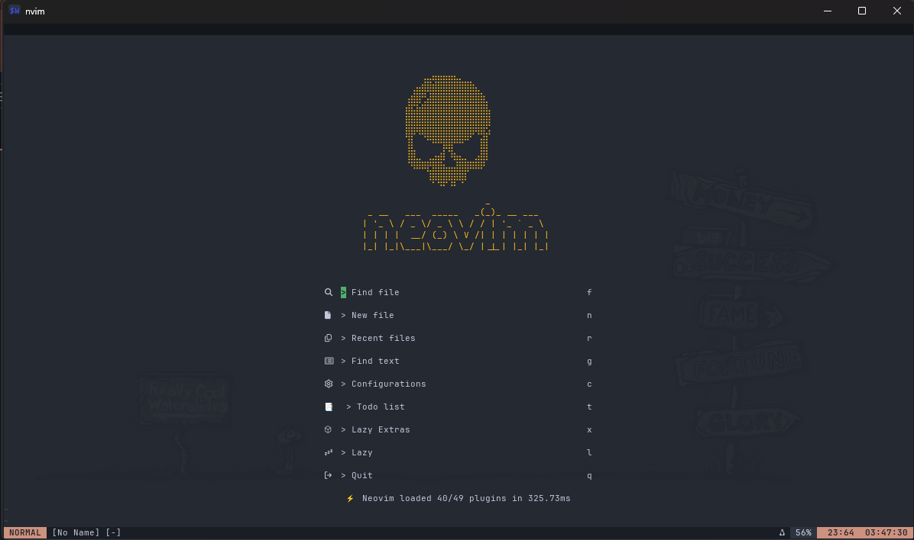
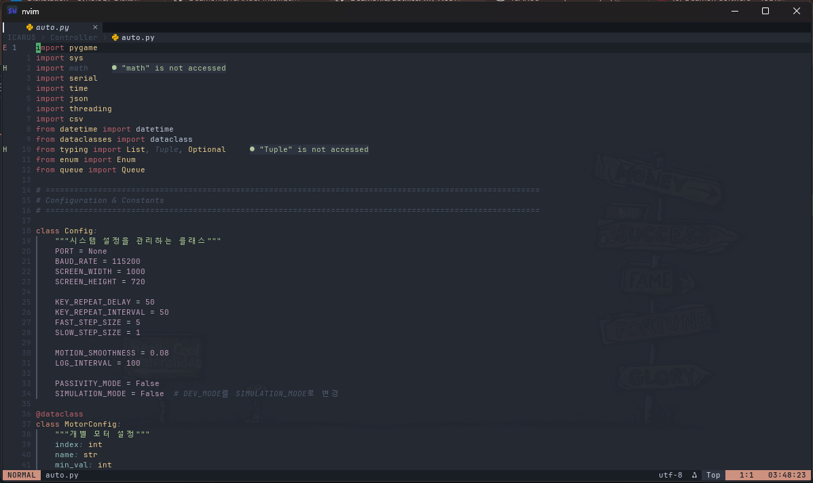
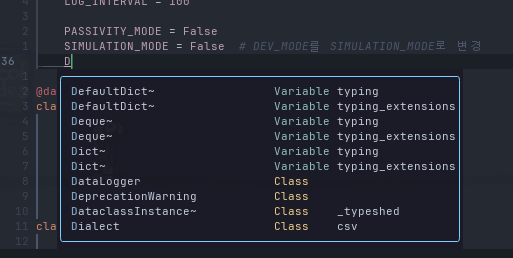
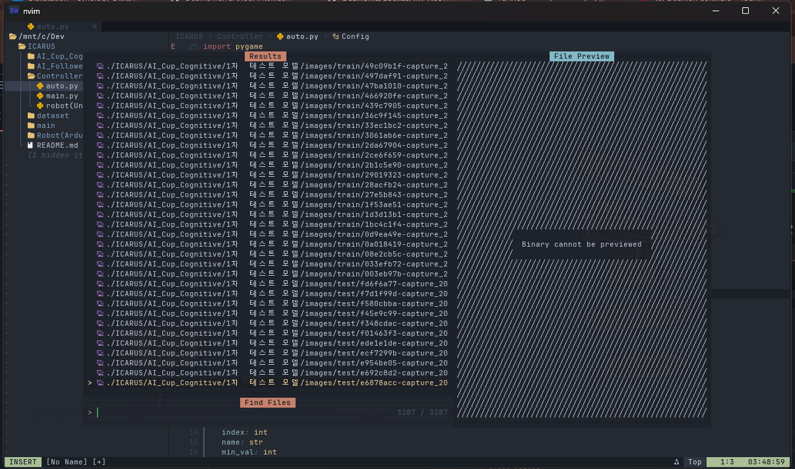
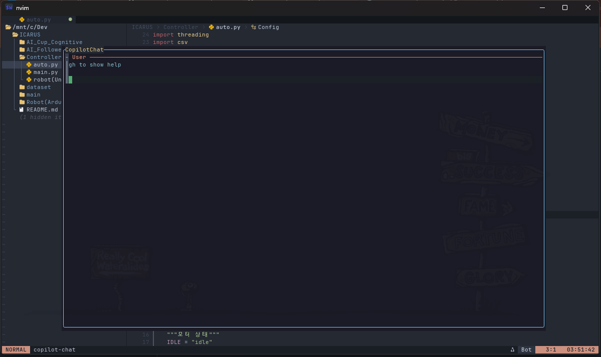
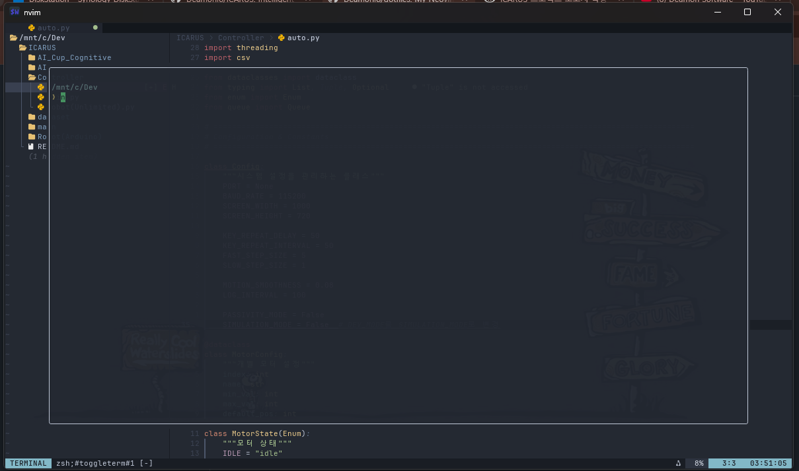

<div align="center">

# ⚡ Neovim Dotfiles

### My Personal Neovim Configuration

*A modern, feature-rich Neovim setup powered by Lazy. nvim*


---

**A fast, extensible, and beautiful Neovim configuration**

</div>

---

## 📋 목차

- [프로젝트 소개](#-프로젝트-소개)
- [주요 기능](#-주요-기능)
- [스크린샷](#-스크린샷)
- [플러그인 목록](#-플러그인-목록)
- [설치 방법](#-설치-방법)
- [키 매핑](#-키-매핑)
- [LSP 설정](#-lsp-설정)
- [커스터마이징](#-커스터마이징)

---

## 🎯 프로젝트 소개

이 저장소는 **Lazy.nvim** 플러그인 매니저를 사용하는 제 개인 Neovim 설정입니다. 

### 💡 설계 철학

- ⚡ **빠른 시작 시간**: Lazy loading으로 최적화
- 🎨 **아름다운 UI**: Nordic 테마 + 커스텀 상태바
- 🧠 **강력한 LSP**: Mason + nvim-lspconfig
- 🤖 **AI 통합**: Avante.nvim으로 Gemini/OpenAI 지원
- 🔧 **쉬운 확장**:  모듈화된 구조

### 🌟 특징

- ✅ **Lua 100%**: 순수 Lua로 작성
- ✅ **Lazy. nvim**: 플러그인 lazy loading
- ✅ **LSP 지원**: 6개 언어 서버 자동 설치
- ✅ **AI 코딩 어시스턴트**: Gemini/OpenAI 통합
- ✅ **강력한 UI**:  Noice, Alpha, Lualine

---

## ✨ 주요 기능

### 1. 📦 플러그인 매니저:  Lazy.nvim

**장점:**
- 🚀 빠른 시작 시간
- 📦 선언적 플러그인 관리
- 🔄 자동 업데이트 확인
- 📊 플러그인 로딩 프로파일링

**설정:**
```lua
-- init.lua
require("config.lazy")
```

---

### 2. 🎨 테마:  Nordic

**AlexvZyl/nordic.nvim**

- 북유럽 스타일의 어두운 테마
- 눈에 편안한 색상 팔레트
- Treesitter 완벽 지원

**특징:**
```
- Background:   #242933
- Foreground: #D8DEE9
- Accent:  #88C0D0
- Warning:  #EBCB8B
- Error:  #BF616A
```

---

### 3. 🧠 LSP (Language Server Protocol)

**지원 언어:**

| 언어 | LSP 서버 | 기능 |
|---|---|---|
| Lua | lua_ls | Neovim API 지원 |
| TypeScript/JavaScript | ts_ls | React, Vue 지원 |
| Markdown | remark_ls | 문법 검사 |
| C/C++ | clangd | 컴파일러 통합 |
| Python | pyright | Type checking |
| CSS | cssls | 자동 완성 |

**LSP 기능:**
- ✅ 자동 완성 (nvim-cmp)
- ✅ 진단 (오류/경고)
- ✅ 코드 액션
- ✅ 정의로 이동
- ✅ 호버 문서
- ✅ 자동 포맷팅

---

### 4. 🤖 AI 코딩 어시스턴트:  Avante.nvim

**yetone/avante.nvim**

**지원 AI:**
- 🤖 Gemini (기본)
- 🤖 OpenAI GPT-4/3. 5

**기능:**
- 코드 설명
- 버그 수정 제안
- 리팩토링
- 테스트 코드 생성
- 문서화

**사용 예시:**
```
1. 코드 선택
2. : Avante 실행
3. 질문 입력:  "이 코드를 최적화해줘"
4. AI 응답 받기
```

---

### 5. 💬 UI 개선:  Noice. nvim

**folke/noice.nvim**

**특징:**
- 📢 우측 하단 알림
- 💬 중앙 명령 팔레트
- 🔍 검색창 하단 배치
- ⚡ LSP 진행 상황 표시

**알림 위치:**
```
┌─────────────────────────────────┐
│                                 │
│        Main Editor Area         │
│                                 │
│                        ┌──────┐ │
│                        │Notify│ │
└────────────────────────└──────┘─┘
```

---

### 6. 🏠 시작 화면: Alpha.nvim

**goolord/alpha-nvim**

**대시보드 버튼:**
- 📁 Find file (Telescope)
- 📄 New file
- 🕒 Recent files
- 🔍 Find text (grep)
- ⚙️ Configurations

**ASCII 아트:**
```
        ⠀⠀⠀⢀⣀⣤⣤⣤⣤⣄⡀⠀⠀⠀⠀
        ⠀⢀⣤⣾⣿⣾⣿⣿⣿⣿⣿⣿⣷⣄⠀⠀
        ⢠⣾⣿⢛⣼⣿⣿⣿⣿⣿⣿⣿⣿⣿⣷⡀
        ⣾⣯⣷⣿⣿⣿⣿⣿⣿⣿⣿⣿⣿⣿⣿⣧
        ⣿⣿⣿⣿⣿⣿⣿⣿⣿⣿⣿⣿⣿⣿⣿⣿
                   neovim
```

---

### 7. 📊 상태바: Lualine.nvim

**nvim-lualine/lualine.nvim**

**섹션 구성:**
```
[Mode] [Branch] [Filename]     [Encoding] [Format] [Progress] [Location] [Time]
 ◀────────── 좌측 ────────────▶ ◀─────────────── 우측 ────────────────▶
```

**표시 정보:**
- 현재 모드 (Normal, Insert, Visual)
- Git 브랜치
- 파일명
- 파일 인코딩 (UTF-8)
- 파일 형식 (unix, dos)
- 진행률 (%)
- 커서 위치 (줄: 열)
- 현재 시간 (HH:MM:SS)

**자동 갱신:** 500ms마다

---

### 8. 🔦 추가 기능

**Telescope**: 파일 탐색 및 검색
```lua
-- 파일 찾기
<leader>ff

-- 문자열 검색 (grep)
<leader>fg

-- 최근 파일
<leader>fr
```

**Treesitter**: 구문 하이라이트
- 정확한 구문 분석
- 코드 폴딩
- 인크리멘털 선택

**Toggleterm**: 플로팅 터미널
```lua
-- 터미널 토글
<C-\>
```

**Nvim-ufo**: 코드 폴딩
- LSP 기반 폴딩
- 빠른 접기/펼치기

**Vim-illuminate**: 단어 하이라이트
- 커서 위치 단어 강조
- LSP 참조 표시

**Hover.nvim**: 호버 문서
- K 키로 문서 보기
- 마우스 호버 지원

---

## 📸 스크린샷

### 시작 화면

<div align="center">



*Alpha. nvim 대시보드 - 깔끔한 시작 화면*

</div>

---

### 편집 화면

<div align="center">



*Nordic 테마 + Lualine 상태바 + LSP 진단*

</div>

---

### LSP 자동 완성

<div align="center">



*nvim-cmp 자동 완성 + LSP 문서*

</div>

---

### Telescope 파일 검색

<div align="center">



*Fuzzy finder로 빠른 파일 탐색*

</div>

---

### AI 코딩 어시스턴트

<div align="center">



*Gemini/OpenAI와 실시간 대화하며 코딩*

</div>

---

### 플로팅 터미널

<div align="center">



*Curved 테두리의 플로팅 터미널*

</div>

---

## 📦 플러그인 목록

### 핵심 플러그인

| 플러그인 | 용도 | 카테고리 |
|---|---|---|
| **folke/lazy.nvim** | 플러그인 매니저 | 📦 Core |
| **AlexvZyl/nordic.nvim** | 컬러 테마 | 🎨 UI |
| **nvim-lualine/lualine.nvim** | 상태바 | 📊 UI |
| **goolord/alpha-nvim** | 시작 화면 | 🏠 UI |
| **folke/noice.nvim** | UI 개선 | 💬 UI |

### LSP 관련

| 플러그인 | 용도 |
|---|---|
| **neovim/nvim-lspconfig** | LSP 설정 |
| **williamboman/mason.nvim** | LSP 서버 설치 |
| **williamboman/mason-lspconfig.nvim** | Mason + LSP 통합 |
| **hrsh7th/nvim-cmp** | 자동 완성 |
| **L3MON4D3/LuaSnip** | 스니펫 엔진 |

### 편집 향상

| 플러그인 | 용도 |
|---|---|
| **nvim-telescope/telescope.nvim** | 파일/검색 |
| **nvim-treesitter/nvim-treesitter** | 구문 분석 |
| **lewis6991/hover.nvim** | 호버 문서 |
| **RRethy/vim-illuminate** | 단어 하이라이트 |
| **kevinhwang91/nvim-ufo** | 코드 폴딩 |
| **akinsho/toggleterm.nvim** | 터미널 |
| **folke/twilight.nvim** | 코드 dimming |

### AI & 도구

| 플러그인 | 용도 |
|---|---|
| **yetone/avante.nvim** | AI 코딩 어시스턴트 |
| **rcarriga/nvim-notify** | 알림 |
| **MunifTanjim/nui.nvim** | UI 컴포넌트 |

[전체 플러그인 목록 보기](https://github.com/Deamonio/dotfiles/blob/main/lazy-lock.json)

---

## 🚀 설치 방법

### 사전 요구사항

**필수:**
- ✅ Neovim 0.9.0 이상
- ✅ Git
- ✅ Node.js (LSP 서버용)
- ✅ Cargo (Avante.nvim 빌드용)

**선택:**
- ripgrep (Telescope grep용)
- fd (Telescope 파일 검색용)

---

### 설치 단계

#### 1. 백업 (기존 설정이 있다면)

```bash
# 기존 Neovim 설정 백업
mv ~/.config/nvim ~/.config/nvim.backup
mv ~/.local/share/nvim ~/.local/share/nvim. backup
mv ~/.local/state/nvim ~/. local/state/nvim.backup
mv ~/.cache/nvim ~/.cache/nvim.backup
```

---

#### 2. 저장소 클론

```bash
# Neovim 설정 디렉토리에 클론
git clone https://github.com/Deamonio/dotfiles.git ~/.config/nvim
```

---

#### 3. Neovim 실행

```bash
nvim
```

**자동 실행:**
1.  Lazy.nvim 자동 설치
2. 플러그인 자동 다운로드
3. LSP 서버 자동 설치 (Mason)
4. Treesitter 파서 자동 설치

**완료까지:** 약 2~5분 (인터넷 속도에 따라)

---

#### 4. AI 설정 (선택)

**Gemini API 키 설정:**

```bash
# 환경 변수 설정
export GEMINI_API_KEY="your_api_key_here"

# 또는 ~/. bashrc / ~/.zshrc에 추가
echo 'export GEMINI_API_KEY="your_key"' >> ~/.bashrc
```

**OpenAI API 키 설정:**

```bash
export OPENAI_API_KEY="your_openai_key"
```

**플러그인 설정 변경:**
```bash
# lua/plugins/avante.lua 편집
nvim ~/. config/nvim/lua/plugins/avante.lua

# Gemini → OpenAI로 변경
# provider = "openai" 주석 해제
```

---

## ⌨️ 키 매핑

### 기본 설정

**Leader 키:** `Space`

---

### 일반 모드

#### 파일 & 검색

| 키 | 동작 |
|---|---|
| `<leader>ff` | 파일 찾기 (Telescope) |
| `<leader>fg` | 문자열 검색 (grep) |
| `<leader>fr` | 최근 파일 |
| `<leader>fb` | 버퍼 목록 |

#### LSP

| 키 | 동작 |
|---|---|
| `K` | 호버 문서 (정의 보기) |
| `gd` | 정의로 이동 |
| `gr` | 참조 찾기 |
| `<leader>ca` | 코드 액션 |
| `<leader>rn` | 이름 변경 |
| `<leader>dw` | 진단 경고 토글 |

#### 진단

| 키 | 동작 |
|---|---|
| `[d` | 이전 진단 |
| `]d` | 다음 진단 |
| `<leader>e` | 진단 플로팅 창 |
| `<leader>q` | 진단 목록 |

#### UI

| 키 | 동작 |
|---|---|
| `<C-\>` | 터미널 토글 |
| `<leader>e` | 파일 트리 (NvimTree) |
| `<leader>w` | 윈도우 명령 |

---

### 마우스

| 동작 | 키 |
|---|---|
| 호버 문서 | 마우스 올리기 |
| 스크롤 | 마우스 휠 |
| 선택 | 드래그 |

---

## 🧠 LSP 설정

### 자동 설치되는 LSP 서버

```lua
-- lua/plugins/lsp.lua
ensure_installed = {
  "lua_ls",      -- Lua
  "ts_ls",       -- TypeScript/JavaScript
  "remark_ls",   -- Markdown
  "clangd",      -- C/C++
  "pyright",     -- Python
  "cssls",       -- CSS
}
```

---

### 수동 설치

```vim
: Mason
```

**Mason UI에서:**
1. `/` 로 검색
2. `i` 로 설치
3. `u` 로 업데이트
4. `X` 로 제거

---

### LSP 진단 설정

**경고 메시지 토글:**
```lua
<leader>dw
```

**커스터마이징:**
```lua
-- lua/plugins/lsp.lua
vim.diagnostic.config({
  virtual_text = true,  -- 인라인 오류 표시
  signs = true,         -- 사이드바 아이콘
  underline = true,     -- 밑줄
  update_in_insert = false, -- Insert 모드에서 업데이트 안 함
})
```

---

### 자동 포맷팅

**저장 시 자동 포맷:**
```lua
-- lua/plugins/lsp.lua
vim.api.nvim_create_autocmd("BufWritePre", {
  callback = function()
    vim.lsp.buf.format({ async = false })
  end,
})
```

**비활성화:**
```lua
-- 해당 autocmd 주석 처리
```

---

## 🎨 커스터마이징

### 테마 변경

**1. 플러그인 설치:**
```lua
-- lua/plugins/your-theme.lua
return {
  'your-theme/name',
  config = function()
    vim.cmd('colorscheme your-theme')
  end
}
```

**2. Nordic 비활성화:**
```lua
-- lua/plugins/nordic.lua
enabled = false, -- 추가
```

---

### 옵션 설정

**파일:** `lua/config/options.lua`

```lua
-- 탭 설정
vim.opt. tabstop = 4        -- 탭 너비 4칸
vim.opt.shiftwidth = 4     -- 자동 들여쓰기 4칸

-- 줄 번호
vim.opt.relativenumber = true  -- 상대 줄 번호

-- 클립보드
vim.opt.clipboard = "unnamedplus"  -- 시스템 클립보드 사용
```

---

### 키 매핑 추가

**파일:** `lua/config/keymaps.lua`

```lua
-- 예시: jj로 Esc
vim.keymap.set("i", "jj", "<Esc>")

-- 예시: 버퍼 이동
vim.keymap.set("n", "<S-l>", ": bnext<CR>")
vim.keymap.set("n", "<S-h>", ": bprevious<CR>")
```

---

### 플러그인 추가

**1. 새 파일 생성:**
```bash
# lua/plugins/your-plugin.lua
touch ~/. config/nvim/lua/plugins/your-plugin.lua
```

**2. 플러그인 설정:**
```lua
return {
  "author/plugin-name",
  config = function()
    require("plugin-name").setup({
      -- 옵션
    })
  end,
}
```

**3. Neovim 재시작:**
```vim
:qa
nvim
```

**자동 설치됨! **

---

## 📁 프로젝트 구조

```
~/.config/nvim/
├── init.lua                    # 진입점
├── lazy-lock.json              # 플러그인 버전 잠금
├── lua/
│   ├── config/                 # 기본 설정
│   │   ├── lazy.lua            # Lazy.nvim 부트스트랩
│   │   ├── globals.lua         # 전역 변수 (leader key)
│   │   ├── options.lua         # Vim 옵션
│   │   └── keymaps.lua         # 키 매핑
│   └── plugins/                # 플러그인 설정
│       ├── lsp.lua             # LSP 설정
│       ├── noice.lua           # Noice UI
│       ├── alpha.lua           # 시작 화면
│       ├── nordic.lua          # 테마
│       ├── lualine.lua         # 상태바
│       ├── hover.lua           # 호버 문서
│       ├── avante.lua          # AI 어시스턴트
│       ├── nvim-ufo.lua        # 코드 폴딩
│       ├── toggleterm.lua      # 터미널
│       ├── twilight.lua        # Dimming
│       └── vim-illuminate.lua  # 단어 하이라이트
└── README.md                   # 이 문서
```

---

## 🔧 문제 해결

### Lazy.nvim이 설치되지 않음

**증상:**
```
Error:  module 'lazy' not found
```

**해결:**
```bash
# Lazy.nvim 수동 설치
git clone --filter=blob:none --branch=stable \
  https://github.com/folke/lazy.nvim. git \
  ~/.local/share/nvim/lazy/lazy.nvim
```

---

### LSP 서버가 작동하지 않음

**증상:**
```
No LSP clients available
```

**해결:**
```vim
# Mason 확인
:Mason

# LSP 서버 수동 설치
# i 키로 설치

# LSP 로그 확인
:LspLog
```

---

### Treesitter 파서 오류

**증상:**
```
Error: treesitter parser for 'language' not found
```

**해결:**
```vim
: TSInstall language

# 예시
:TSInstall lua
: TSInstall python
```

---

### AI (Avante) 작동 안 함

**증상:**
```
Error:  GEMINI_API_KEY not found
```

**해결:**
```bash
# API 키 설정
export GEMINI_API_KEY="your_key"

# 영구 설정
echo 'export GEMINI_API_KEY="your_key"' >> ~/.bashrc
source ~/.bashrc
```

---

## 💡 팁 & 트릭

### 플러그인 관리

```vim
: Lazy             # Lazy.nvim UI 열기
: Lazy sync        # 플러그인 동기화 (업데이트 + 설치)
:Lazy clean       # 사용하지 않는 플러그인 제거
: Lazy profile     # 플러그인 로딩 시간 확인
```

---

### LSP 명령어

```vim
: LspInfo          # 연결된 LSP 서버 확인
:LspRestart       # LSP 서버 재시작
:LspLog           # LSP 로그 보기
:Mason            # Mason UI
```

---

### Telescope 고급 사용

```vim
# 파일 찾기 (숨김 파일 포함)
:Telescope find_files hidden=true

# Git 파일만 검색
:Telescope git_files

# 현재 버퍼 내 검색
:Telescope current_buffer_fuzzy_find

# 명령어 히스토리
:Telescope command_history
```

---

### 성능 최적화

**로딩 시간 확인:**
```vim
:Lazy profile
```

**Treesitter 최적화:**
```lua
-- lua/plugins/treesitter.lua
ensure_installed = {
  "lua", "python", "javascript"  -- 필요한 것만
}
```

---

## 🤝 기여하기

기여는 언제나 환영합니다! 

### 기여 방법

1. Fork 이 저장소
2. Feature 브랜치 생성:  `git checkout -b feature/AmazingFeature`
3. 변경사항 커밋: `git commit -m 'Add some AmazingFeature'`
4. 브랜치에 Push: `git push origin feature/AmazingFeature`
5. Pull Request 생성

---

## 📜 라이선스

이 프로젝트는 MIT License 하에 배포됩니다.

```
MIT License

Copyright (c) 2025 Deamonio

Permission is hereby granted, free of charge... 
```

---

## 📞 연락처

<div align="center">

### 프로젝트 관리자:   Deamonio


**프로젝트 링크**:  [https://github.com/Deamonio/dotfiles](https://github.com/Deamonio/dotfiles)

</div>

---

## 🙏 감사의 말

이 설정은 다음 프로젝트들을 기반으로 합니다: 

| Neovim | Lazy.nvim | Mason | Telescope |
|---|---|---|---|
| 에디터 | 플러그인 매니저 | LSP 설치 | 파일 검색 |

**특별 감사:**
- 💚 **Neovim Community** - 훌륭한 에디터
- ⚡ **folke** - Lazy.nvim, Noice, Twilight
- 🎨 **AlexvZyl** - Nordic 테마
- 🧠 **Mason Contributors** - LSP 관리
- 🤖 **yetone** - Avante AI 통합

---

<div align="center">

## ⭐ 이 설정이 마음에 드셨다면 Star를 눌러주세요!  

[](https://star-history.com/#Deamonio/dotfiles&Date)

---

**Made with ❤️ and Neovim**

*"The best code is no code.  The second best is code written in Neovim."*

---

**© 2025 Deamonio.  All rights reserved.**

[⬆ 맨 위로 돌아가기](#-neovim-dotfiles)

</div>
